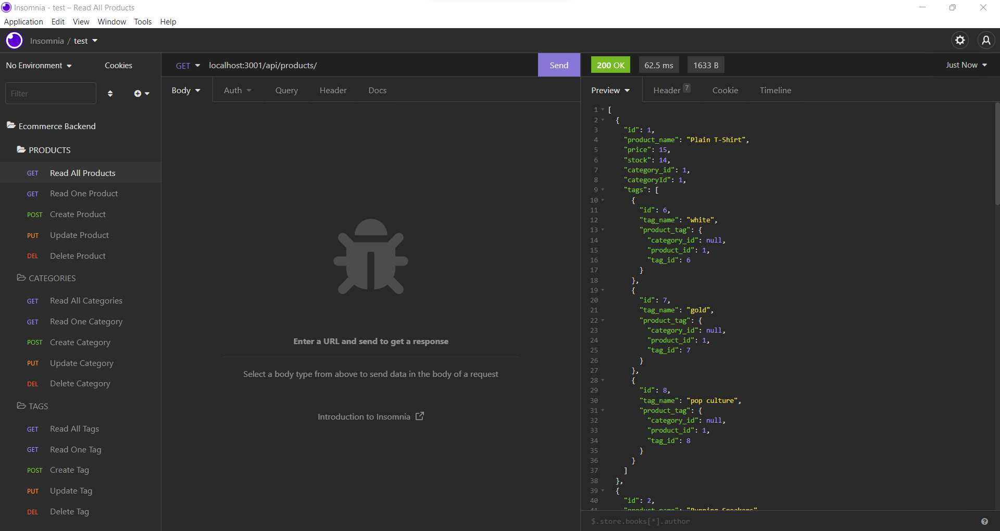
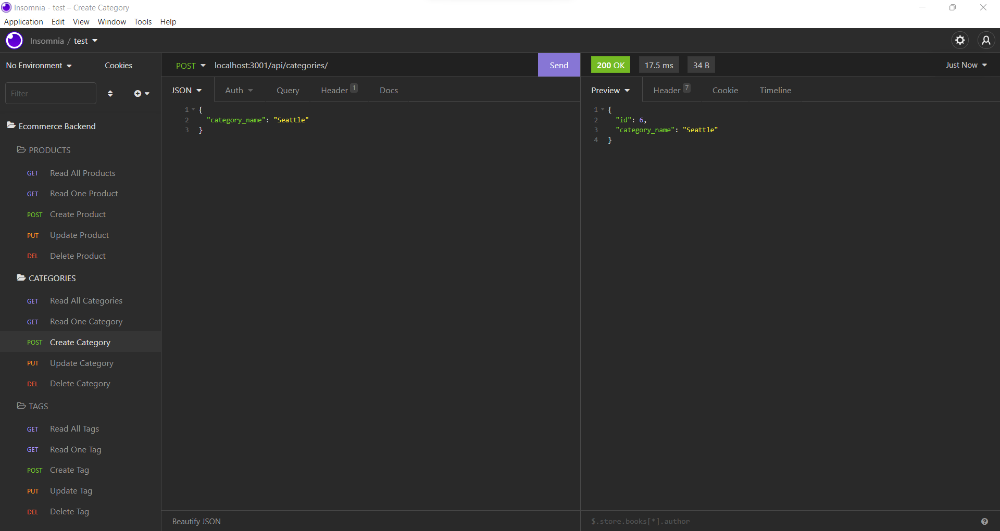

# E-Commerce Back End

[](https://opensource.org/licenses/MIT)

## Deployed Site

[Deployed Site]( https://enigmatic-tor-94718.herokuapp.com/)

[GitHub Repo](https://github.com/framenolan/ecommerce-backend)

## Table of Contents
* [Description](#description)
* [Installation](#installation)
* [Technologies](#technologies)
* [Usage](#usage)
* [Future Development](#future-development)
* [Credits](#credits)
* [Contributing](#contributing)
* [Tests](#tests)
* [Questions](#questions)
* [License](#license)

## Description

With some provided starter code and a focus just on the back-end data, this app provides the code to manage the catalogue of an e-commerce store. Products, product categories, and tags can be created, read, updated, or deleted using routes.

## Installation

To install this application, enter the following command into your terminal:

```md
npm i
```

Additionally, you'll need to enter your mysql username and password into the '.env.EXAMPLE' file in the root folder and rename the file to '.env'.

To initialize the creation of the database, run the following script:

```md
npm run resetdb
```

You'll be prompted to enter your mysql2 password. Once entered, it'll create the schema.

To use the provided seed data, run the following command in your terminal, or feel free to seed with your own test data:

```md
npm run seed
```


## Technologies

- [JavaScript](https://developer.mozilla.org/en-US/docs/Web/JavaScript)
- [Node.js](https://nodejs.org/)
- [MySQL2](https://www.npmjs.com/package/mysql2)
- [Sequelize](https://www.npmjs.com/package/sequelize)
- [Dotenv](https://www.npmjs.com/package/dotenv)


## Usage

To start the app, enter the following command in your terminal:

```md
npm start
```

As the code stands, there's no front-end integration so all rountes must be accessed through a URL or route-testing client (such as Insomnia). Below are a couple of screenshots and a screencaptured video of each route being tested in Insomnia.




[Screenshare Video Walkthrough](https://drive.google.com/file/d/12WO1awL6CDBrN0yedtAn35PcNTpU_keh/view)

## Future Development

Currently there are no plans for future development.

## Credits

- Nolan Frame

## Questions

Please checkout [https://github.com/framenolan/](https://github.com/framenolan/).

## License

The MIT License (MIT)

Copyright (c) 2022 Nolan Frame

Permission is hereby granted, free of charge, to any person obtaining a copy of this software and associated documentation files (the "Software"), to deal in the Software without restriction, including without limitation the rights to use, copy, modify, merge, publish, distribute, sublicense, and/or sell copies of the Software, and to permit persons to whom the Software is furnished to do so, subject to the following conditions:

The above copyright notice and this permission notice shall be included in all copies or substantial portions of the Software.

THE SOFTWARE IS PROVIDED "AS IS", WITHOUT WARRANTY OF ANY KIND, EXPRESS OR IMPLIED, INCLUDING BUT NOT LIMITED TO THE WARRANTIES OF MERCHANTABILITY, FITNESS FOR A PARTICULAR PURPOSE AND NONINFRINGEMENT. IN NO EVENT SHALL THE AUTHORS OR COPYRIGHT HOLDERS BE LIABLE FOR ANY CLAIM, DAMAGES OR OTHER LIABILITY, WHETHER IN AN ACTION OF CONTRACT, TORT OR OTHERWISE, ARISING FROM, OUT OF OR IN CONNECTION WITH THE SOFTWARE OR THE USE OR OTHER DEALINGS IN THE SOFTWARE.
